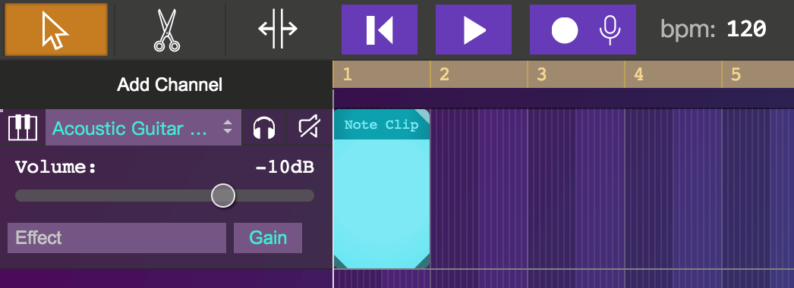

# Introduction About MusicEditor

From the name, you know it is a tool that can let you create digital music in your browser, it is so cool!

MusicEditor is another project I developed at Codemao Company. Same as [VoxelEditor](https://github.com/Francis-Tao-jinjin/VoxelEditor), it is also going to be part of the [Box3](https://box3.codemao.cn) paltform. But since it is not fully integrated into the platform, you can directly open this [link](https://box3.codemao.cn/musicEditor) to access it.

It is bascilly a DAW(digital audio workstation) runing on the web, and the most of the functionality could just work without the internet connection.

## Example project files of Box3 MusicEditor

you can access the MusicEditor at https://box3.codemao.cn/musicEditor

screen shot of 'Bad Guy'-Billie Eilish in the editor :

## Hellow World

When you use this tool for the first time, you can click ‘Add Channel’ to add an instrument channel, so you can create music with the built-in virtual instrument.

## Quick start
You can change the instrument from the channel menu.

Except for the Sampler, all other instruments are generated using the WebAudio API, so there is no need to download the instrument's sound library over the Internet.

You can open the piano tool to play these instrument and record the piece when you play them.

When you finish recording, a note region will be create at that channel, which record all the note you just play.

You can also create an empty note region by double click the empty track area of that channel.

Double click a note region will open the note clip editor panel. Which is the place allow you to edit the clip note by note.

Operations like select, move, delete, adjust the length of the note are all supported.

## Clip(or a Region)  Editing

You can easily edit a clip with the three tools in the upper left.

'Cursor' tool allow you to loop the clip or change the total duration of the clip.

'scissors' tool let you cut the clip.

'strech' tool allow you to strech or squeeze the clip, If it is the audio clip that you are editing, then it will generate pich shift effect to the audio.

## Play and Export it to Mp3 file !!

click the play button in the middle to listen the music you just create. Click download button to export the project to mp3 or wav file.

That is !!

There are more cool features, hope you can explore it yourself.